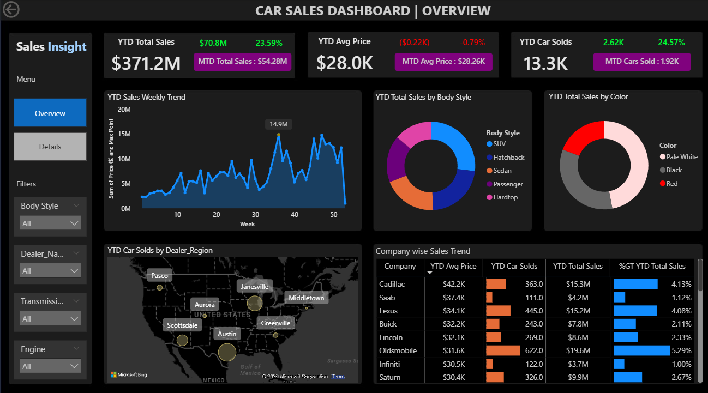
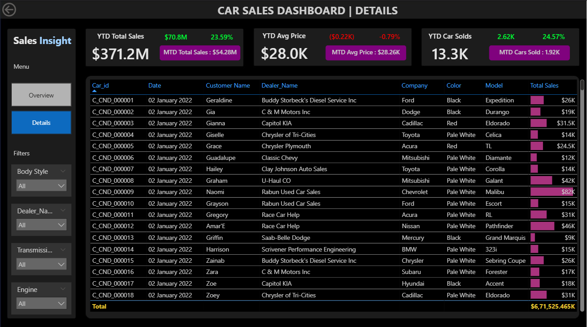

# Car Sales Dashboard 🚗

An interactive Power BI dashboard analyzing car sales performance across regions, models, and time periods.

## 📊 Key Insights
- Top-selling car models by revenue and units
- Month-over-month sales trend analysis
- Regional performance breakdown
- KPIs: Total Revenue, Units Sold, Avg. Selling Price, YoY Growth

## 🛠 Tools Used
- Power BI (DAX, Power Query)
- Excel / CSV for data source
- Data cleaning and transformation via Power Query

## 📸 Dashboard Preview

## 📂 Files
| File | Description |
|------|-------------|
| `Car sales Dashboard.pbix` | Main Power BI file |
| `Car Sales.xlsx` | Raw dataset |

## 👤 Author
Rishabh Raj | [LinkedIn](https://www.linkedin.com/in/rishabh-raj-b97302261/) | rishabhraj.data@gmail.com
